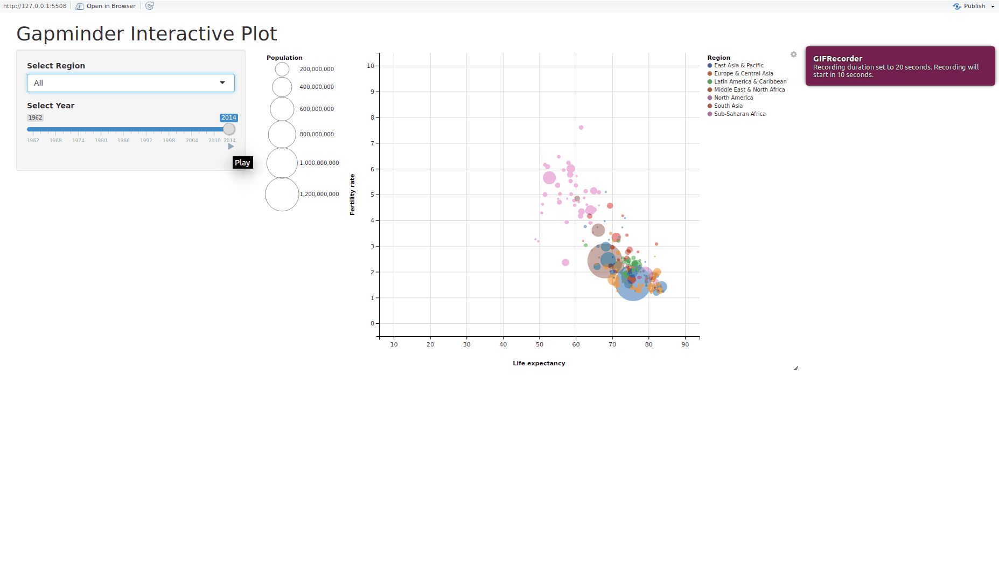

# WorldBank-Shiny


[Try it out!](https://aguimaraesduarte.shinyapps.io/worldbank-visualizer/)

[The World Bank](http://databank.worldbank.org/data/reports.aspx?source=2&series=SP.POP.1564.TO.ZS&country=) provides a lot of data for all countries between 1960 and 2015, such as Life Expectancy, Fertility Rate, Population, and many others. In this project, I chose those three variables in order to build an R Shiny app that plots the Fertility Rate vs Life Expectancy throughout the years. Each country is a single point that moves through the plot with time, and the size of the point is proportional to the total population for that country. My goal was to reproduce [this interactive graph](https://www.google.com/publicdata/explore?ds=d5bncppjof8f9_&ctype=b&strail=false&nselm=s&met_x=sp_dyn_le00_in&scale_x=lin&ind_x=false&met_y=sp_dyn_tfrt_in&scale_y=lin&ind_y=false&met_s=sp_pop_totl&scale_s=lin&ind_s=false&dimp_c=country:region&ifdim=country&iconSize=0.5&uniSize=0.035) from Google. The result is fairly close.

# Building the app
Before heading into the app part of the process, let's first talk about the data and the tools I used.

## Cleaning the data
The downloaded CSV is a "short and fat" table, where each country represents one row, and there is a column for each year. All three indicator variables are also concatenated into one single column, which is not ideal for this analysis. Therefore, we use `reshape2` and `dplyr` to _melt_ and _cast_ the data frame and iteratively construct one that is "long and thin". My final columns are **Country**, **Region**, **Year**, **Fertility**, **LifeExp**, and **Population**. The geographical region for each country was downloaded separately from the metadata, and needs to be merged into our data frame by country.

```
# Read data
df <- read.csv(<path_to_csv_file>, stringsAsFactors = F)
# Remove trailing data (garbage from WDI)
df <- df[1:(nrow(df)-5),]
# Change column names
names(df) <- c("Indicator", "IndCode", "Country", "Country.Code", as.character(1960:2015))
# Get metadata
meta <- read.csv(<path_to_metadata_csv_file>)
meta <- meta[,c("Country.Code", "Region")]
meta <- meta[meta$Region!="",]
# Merge tables
df <- merge(df, meta, "Country.Code")
# Keep only columns of interest
df <- df[,c(2, 4, 5:ncol(df))]
df$Indicator <- factor(df$Indicator)
df$Country <- factor(df$Country)
df$Region <- factor(df$Region)
# Melt years
df <- melt(df, c("Indicator", "Country", "Region"), 5:(ncol(df)-1), variable.name = "Year", value.name = "Value")
df$Value <- as.numeric(df$Value)
# Cast indicators
df <- dcast(df, Country+Region+Year~Indicator, value.var = "Value")
# Change column names
names(df) <- c("Country", "Region", "Year", "Fertility", "LifeExp", "Population")
# Define regions vector
regions <- sort(as.vector(unique(df$Region)))
regions <- append(regions, "All", 0)
```

## Shiny UI
Here, I decided to keep a clean interface for the UI:
- a sidebar panel with a region dropdown selection, the year slider, and the population size slider;
- a main panel with the plot and legends.

The user choose which countries to plot by selecting the region from the dropdown menu (default is "All"), and can also choose the specific year for which to plot the points. This year slider has a "play" button that animates the graph. The user can also make the circles bigger or smaller according to taste.

I opted to use `ggvis` instead of `ggplot2` for this project, but it should not be too complicated to switch.

```
ui <- fluidPage(
  headerPanel("Gapminder Interactive Plot"),
  sidebarPanel(width = 3,
    selectInput("region", "Select Region", regions),
    sliderInput("year", "Select Year",
                min = 1962, max = 2014, value = 1998, sep = "",
                animate = animationOptions(interval = 100)),
    sliderInput('pop_size', "Population",
                min = 500, max = 5000, value = 3000, step = 500, sep = "")
  ),
  mainPanel(
    ggvisOutput("plot"),
    uiOutput("plot_ui")
  )
)
```

## Shiny Server
The server part of the app is where the cool stuff happens. First, I subset the dataframe for the year selected in the slider as well as for the region selected in the dropdown. If the region is "All", we don't need to subset per region.

Aftewards, it's a matter of piping the data through `ggvis`. We color by Region, and play with the opacity so that when the mouse hovers over a country, the opacity increases. Each circle size is proportional to the country population. The smallest population will have a circle with and area of 10 square pixels, and the biggest one will have and area defined by the slider on the sidebar. The legend for the population size had to be manually pushed to the left of the plot, or else the two legends would overlap. This is a known issue with ggvis and tooltips, so this workaround had to be made.

Talking about tooltips, these show up when the mouse hovers over a circle. The circle in question will become opaque, and a tooltip will pop up showing several information about the country, such as name, region, population, life expectancy, and fertility rate.

```
server <- function(input, output) {
  
  sub_df <- reactive({
    s <- subset.data.frame(df, Year == input$year, drop=T)
    s[is.na(s$LifeExp), "Fertility"] <- NA
    s[is.na(s$Fertility), "LifeExp"] <- NA
    
    region <- input$region
    if(region != "All"){
      s <- subset.data.frame(s, Region == region, drop = T)
    }
    
    s <- s[!is.na(s$LifeExp),]
    return(s)
  })
  
  vis <- reactive({
    popsize <- input$pop_size
    
    sub_df %>%
      ggvis(~LifeExp, ~Fertility, fill = ~Region,
            fillOpacity := 0.5, fillOpacity.hover := 1) %>%
      #layer_text(text := ~Country) %>%
      
      set_options(width = 1000, height = 600, renderer = "svg") %>%
      
      add_axis("x", title = "Life expectancy", title_offset = 50) %>%
      add_axis("y", title = "Fertility rate", title_offset = 50) %>%
      scale_numeric("x", domain = c(10, 90), nice = FALSE) %>%
      scale_numeric("y", domain = c(0, 10), nice = FALSE) %>%
      scale_numeric("size", range = c(10, popsize), nice = FALSE) %>%
      
      layer_points(size = ~Population, key := ~Country) %>%
      add_legend("size", orient = "left", title="Population") %>%
      set_options(duration = 0) %>%
      
      add_tooltip(function(data){
        paste0("Country: ", as.character(data$Country), "<br>",
               "Region: ", as.character(data$Region), "<br>",
               "Population: ", prettyNum(data$"Population", big.mark=",", scientific=FALSE), "<br>",
               "Life Expectancy: ", as.character(round(data$LifeExp, 2)), "<br>",
               "Fertility Rate: ", as.character(round(data$Fertility, 2)))
      }, "hover")
  })
  
  vis %>%
    bind_shiny("plot", "plot_ui")
}
```

# Final thoughts
The app is then run by calling `shinyApp(ui = ui, server = server)`, and produces a fairly similar output to what we were trying to replicate. Future work will include being able to select the x and y axes, as well as maybe labeling some countries (I could only label all of them, which made the plot look terrible).
